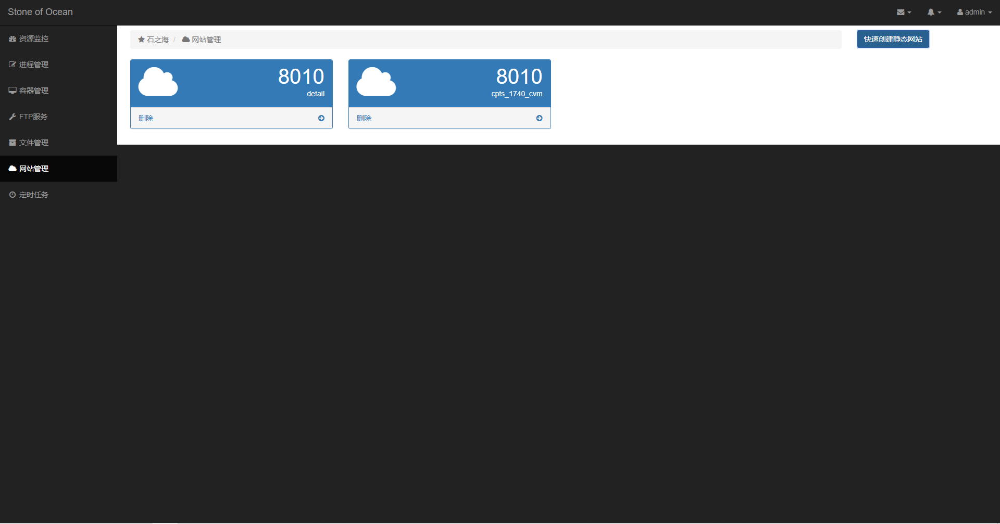

# Linux Control Panel

[]()

[](http://chunibyo.xyz:8085/job/tapd/)

## :one: How To Use

1. 配置

```bash
sh script/install_*

virtualenv venv
venv/bin/python main.py
```

2. `config`目录下新建`oss.yaml`

   ```yaml
   oss:
     Auth:
       AccessKeyId: XXXXXXXXXX
       AccessKeySecret: XXXXXXXXXXX
     Bucket:
       EndPoint: XXXXXXXXXXX
       BucketName: XXXXXXXXXXXX
   ```

## :two: 功能介绍

### 2.1 资源监控


### 2.2 进程管理(每秒刷新)


### 2.3 容器管理


### 2.4 FTP服务


### 2.5 文件管理


### 2.6 网站管理





### 2.7 定时任务


## :three: 后端功能的实现

### 3.1 系统管理

#### 3.1.1 DNS设置

```bash
vim /etc/resolvconf/resolv.conf.d/base
```


#### 3.1.2 用户管理

1. 创建user

   ```bash
   useradd -m chunibyo
   # -m 创建/home目录
   ```

2. 设置user密码

   ```bash
   passwd chunibyo
   ```

   

3. 删除user

   ```bash
   userdel chunibyo
   ```

4. 创建group

   ```bash
   groupadd test_group
   ```

5. 删除group

   ```bash
   groupdel test_group
   ```

6. 添加user到group

   ```bash
   usermod -G test_group chunibyo
   ```

7. 删除user从group

   ```bash
   gpasswd -d chunibyo test_group
   ```

### 3.2 docker

```bash
docker run --name some-mysql --restart=always -e MYSQL_ROOT_PASSWORD=foo -d mysql:latest

docker run --name some-nginx --restart=unless-stopped -d nginx

docker run --name some-redis --restart=unless-stopped  -d redis
```

### 3.3 网络安全

1. **添加**拒绝8888端口的tcp连接

   ```bash
   sudo iptables -t filter -A INPUT -j DROP -p tcp --dport 8888
   ```

   

2. **删除**拒绝8888端口的tcp连接
   

## :four: ​DevOps工作流


### 4.1 [SonarQube](https://www.fosstechnix.com/install-sonarqube-on-ubuntu/#step-3-download-and-install-sonarqube-on-ubuntu)

1. MySQL建库

   ```sql
   create database sonarqube character set utf8 collate utf8_general_ci;
   ```

2. 建立 `sonar` 用户(因为mysql在容器里面并且没有开放端口, 所以直接监听公网最方便)

   ```sql
    create user 'sonar'@'%' identified by 'foo';
    
    grant all privileges on sonar.* to 'sonar'@'%' ;
    
    flush privileges;
   ```

3. 安装sonar

4. 打包成service

   ```
   /lib/systemd/system/sonar.service
   
   [Unit]
   Description=SonarQube service
   After=syslog.target network.target
   
   [Service]
   Type=forking
   
   ExecStart=/opt/sonarqube/bin/linux-x86-64/sonar.sh start
   ExecStop=/opt/sonarqube/bin/linux-x86-64/sonar.sh stop
   
   User=sonar
   Group=sonar
   Restart=always
   
   LimitNOFILE=65536
   LimitNPROC=4096
   
   
   [Install]
   WantedBy=multi-user.target
   ```

   

### 4.2 Ansible

`apt`仓库默认安装

```yaml
---
- hosts: cugergz.chunibyo.xyz
  vars:
    repo_folder: /root/Panel
  remote_user: root
  tasks:

    - name: "Create directory if not exists"
      file:
        path: "{{ repo_folder }}"
        state: directory
        mode: 0755
        group: root
        owner: root

    - name: kill old process
      shell: ps aux | grep main.p[y] | awk '{print $2}' | xargs kill
      ignore_errors: true

    - name: clone repository
      git:
        repo: https://github.com/chunibyo-wly/LinuxControlPanel.git
        dest: "{{ repo_folder }}"
        update: yes
        force: yes

    - name: create python virtualenv
      pip:
        requirements: "{{ repo_folder }}/requirements.txt"
        virtualenv: "{{ repo_folder }}/venv"
        virtualenv_command: /usr/bin/python3 -m venv

    - name: install ftp
      shell: "sh {{ repo_folder }}/script/install_ftp.sh"

    - name: install nginx
      shell: "sh {{ repo_folder }}/script/install_nginx.sh"

    - name: install cron
      shell: "sh {{ repo_folder }}/script/install_crontab.sh"

    - name: create database
      shell: "cd {{ repo_folder }} && sudo venv/bin/python db/init.py"

    - name: start server
      shell: "cd {{ repo_folder }} && nohup sudo {{ repo_folder }}/venv/bin/python main.py > /tmp/LinuxControlPanel.log 2>&1 &"
```

